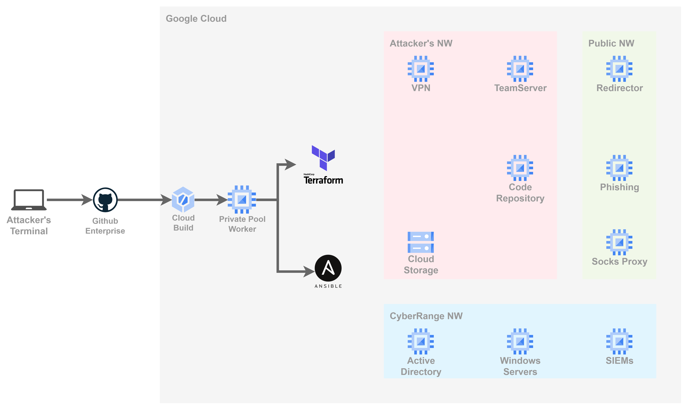
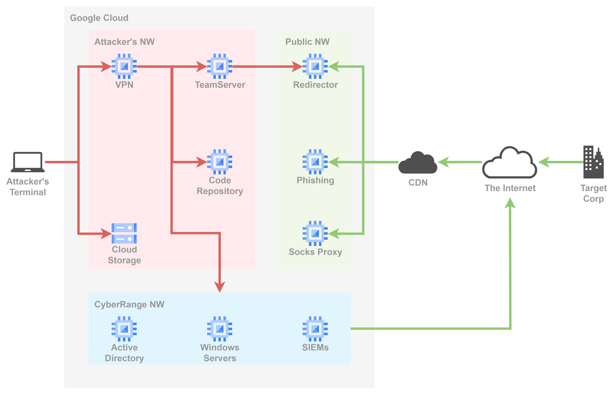

# Redteam Infrastructure using Terraform and Ansible

## Overview
This lab  is used for automatic creation of redteam infrastructure, including C2 server, HTTP redirector and testing environments like AD server and terminals.
> Warning: This lab is still early PoC stage and there are lots of hardcoded credentials. Please DO NOT use this lab in a production environment.

## Functions

| Name | Functions | Components |
| ---- | ---- |---- |
| Teamserver |MultiPlayer Payload Generation Listeners (HTTP/HTTPS,SMB,DNS) Customizable C2 Profiles | CobaltStrike Havoc Sliver |
| Attacker's terminal | Connect teamserver R&D | Windows11 Kali Linux VMWare/VirtualBox |
| Recdirector | HTTP/S traffic redirection Controlled by  RewriteRule in Apache SSH reverse port forwarding Restrict direct inbound access to the C2| Apache Web Server |
| CDN | Proxy traffic to the redirectors | CloudFront Azure CDN CloudFrare |
| Socks proxy | Passing through firewalls using HTTP/HTTPS Increase network communication speed | Chisel |
| VPN | Connection from attacker's terminal to C2 MFA | OpenVPN YubiKey/Google Authenticator |
| Phishing | Upload C2 agents | Apache Web Server |
| Code repository | Git | GitLab |
| Storage | Cloud-based object storage Policy based protection | GoogleCloud Storage |
| CyberRange Testing | Testing operation R&D | Windows Server Active Directory Windows11 AV/EDR SIEM |

## Diagrams

* Building Flow

* Networking

## GitOps Style Implementation
The lab uses Google Cloud to host virtusl machines and virtual networks.  
In order to make the environment disposable, almost all the components are implemented using IaC(terraform and ansible) for automatic construction.

The codes is intended for continuous integration and delivery (CI/CD) pipeline on CloudBuild and Github. 

## Requirements (manual creation)
* Github repository which hosts these codes
* Google Cloud project
* Service Account which has all the privileges below
    - under construction
* Storage blob to store tfstate file
* VPC (name: redteam-vpc)
* VPC peering settings for cloudbuild private pool
* CloudBuild settings
    - Trigger: start building stage when pushed to the Github branch
    - private pool

## Usage
To build the lab, push this repository to the Github branch.

## Roadmap
* Eliminate hardcoded creds
* Eliminate manual creation parts described above
* Create CDNs
* Documentation