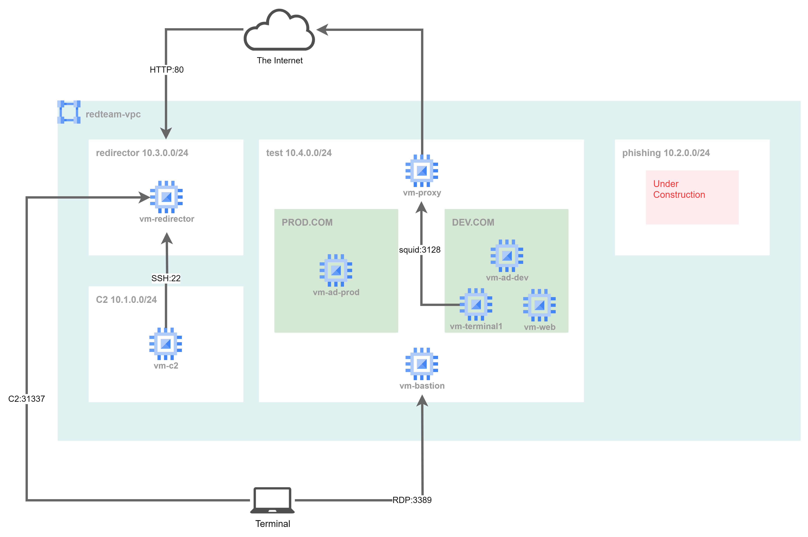

# Automated Creation of Redteam Infrastructure using Terraform and Ansible

## Overview
This lab  is used for automatic creation of redteam infrastructure, including C2 server, HTTP redirector and testing environments like AD server and terminals.

> Warning: This lab is still early PoC stage and there are lots of hardcoded credentials. Please DO NOT use this lab in a production environment.

## Diagrams

## GitOps style implementation
The lab uses Google Cloud to host virtusl machines and virtual networks.  
In order to make the environment disposable, almost all the components are implemented using IaC(terraform and ansible) for automatic construction.

The codes is intended for continuous integration and delivery (CI/CD) pipeline on CloudBuild and Github. 

## Requirements (manual creation)
* Github repository which hosts these codes
* Google Cloud project
* Service Account which has all the privileges below
    - under construction
* Storage blob to store tfstate file
* VPC (name: redteam-vpc)
* VPC peering settings for cloudbuild private pool
* CloudBuild settings
    - Trigger: start building stage when pushed to the Github branch
    - private pool

## Usage
To build the lab, push this repository to the Github branch.

## Roadmap
* Eliminate hardcoded creds
* Eliminate manual creation parts described above
* Create Phishing environments
* Create CDNs
* Documentation